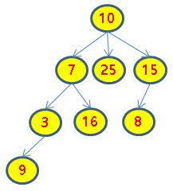

# 기초 DFS 연습

한 나라에 가계도가 있다.

이 나라는 왕위를 계승할 때 장자들 중에서 자기보다 능력이 뛰어난 첫번째 자손에게 왕위를 물려 준다.

각 왕의 능력은 유니크하며 1~99 사이의 값을 가진다.

또한 각 왕들이 가질 수 있는 자식 수는 최대 5명까지이다.

dfs_init()을 통해서 N-1개의 부모자식 관계를 전달 받는다.

첫번째 입력으로 path[0][0]값은 29이고 path[0][1]값이 37이 들어오는데

이것은 능력 29를 가진 왕의 자식이 능력 37을 가지고 있다는 것이다.

이 정보들을 모두 연결하면 tree가 된다.

형제들의 순서는 dfs_init()를 통해서 입력받은 순서이다.

 

다음 예를 보자.

 

만약 왕이 10이라면 왕위계승은 7-3-9-16-25-15-8 순으로 검색도중 10보다 큰 첫번째 수가 16이므로 16왕에게 왕위를 계승한다.

다른 예로 왕이 7이라면 3-9-16 순으로 검색하므로 7보다 첫번째 큰 수는 9가 되어 9가 왕위를 계승하게 된다.

그런데 25왕의 경우는 자손이 없으므로 왕위 계승을 할 수 없고 15왕의 경우는 자기보다 큰 능력을 가진 왕이 자손 중에 없으므로 역시 왕위 계승을 할 수 없다.

 

왕위계승을 하지 못하는 경우는 -1을 반환한다.

dfs_init()에 N-1으로 부자 관계 수가 전달되며 i번째 관계는 path[i][0]은 부모, path[i][1]이 자식이 된다.

전달되는 인물 수는 최대 40을 넘지 않는다.

예를 들어 10과 7의 관계일 경우 path[i][0] = 10, paht[i][1] = 7이다.

dfs()를 통해서 k왕의 왕위를 계승받을 자손왕을 반환하라.